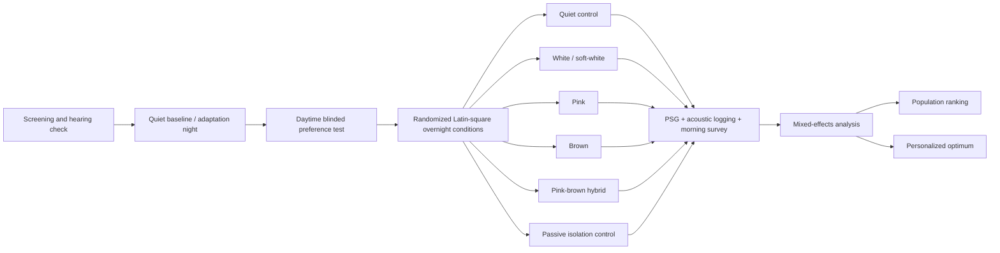

# Sleep-Noise Algorithms for Background Listening and Sound Masking

## Executive summary

The strongest conclusion from the research is **not that one “color” of noise is universally best**, but that two partly
competing objectives determine preference: **masking efficiency** and **perceptual comfort**. White noise supplies
substantial high-frequency energy and is therefore a strong general-purpose masker, but many listeners describe its hiss
as bright or harsh. Brown noise suppresses that high-frequency energy much more strongly and is therefore often
perceived as softer or deeper, but it can leave speech consonants, alarms, honks, and other higher-frequency
disturbances inadequately masked. Pink noise occupies the useful middle ground. A **pink–brown hybrid** is, from an
engineering perspective, particularly attractive because it can preserve pink-like mid/high-frequency masking while
adding the low-frequency softness users associate with brown noise; however, direct sleep trials of such hybrids are
essentially absent. Canonically, power spectral density follows \(S (f)\propto f^{-\beta}\), with \(\beta=0\) for white,
1 for pink, and 2 for brown noise, corresponding to PSD slopes of approximately 0, −3, and −6 dB/octave.
citeturn20search1turn20search7

The evidence that **continuous broadband noise improves sleep itself is much weaker than its popularity suggests**. A
2021 systematic review covering 38 studies found results ranging from improvement to sleep disruption and rated the
evidence that continuous broadband noise improves sleep as **very low quality** under GRADE. citeturn24view0 There
are nevertheless credible positive findings in selected circumstances. In an 18-person randomized crossover
transient-insomnia experiment, filtered broadband noise around 46 dB reduced median N2 sleep-onset latency from 19 to 13
minutes, a 38% reduction. citeturn25view8turn25view9 A small ICU-noise experiment likewise showed a powerful masking
mechanism: mixed-frequency white noise reduced the contrast between the continuous background and transient noise peaks,
and arousal frequency fell from 48.4/h during ICU noise to 15.7/h with added masking noise; critically, the *change* in
level from background to peak predicted arousal better than the peak level itself. citeturn24view7

Recent high-quality studies make the sleep-versus-masking trade-off especially clear. In a 2026 seven-night crossover
polysomnography study of 25 healthy adults, continuous **50 dBA pink noise alone reduced REM sleep by 18.6 minutes**
relative to the quiet control, while environmental noise reduced N3 by 23.4 minutes. Pink noise reduced some
event-related responses, but earplugs were substantially better at protecting sleep architecture, recovering about 72%
of the environmental-noise-induced N3 loss. citeturn25view0turn25view1turn25view2turn25view3 In a separate 2026
crossover pilot with 12 adults, **45 dB LAeq continuous pink noise from 20 Hz to 20 kHz** attenuated cortical responses
to traffic events and completely masked the quietest 45-dB events, yet did not significantly improve overall sleep
macrostructure and worsened several subjective sleep-quality and auditory-fatigue measures relative to quiet. The
authors explicitly identified the central engineering dilemma: quieter masking is less disturbing but masks less; louder
masking masks better but can itself disturb sleep. citeturn25view5turn25view6turn25view7

Consumer preference data are much stronger for **using background sound in general** than for choosing one color over
another. A Talker Research survey of 1,000 U.S. adults conducted in November 2024 found that 38% reported using white
noise or other sounds to help fall asleep; use was 49% in Gen Z, 41% in Millennials, 40% in Gen X, and 32% in baby
boomers. Those data do **not** separate true white noise from fans, ambient sounds, pink noise, or brown noise.
citeturn17search0 Consumer/platform evidence suggests that white remains the dominant generic category name, while
interest in brown noise has risen markedly: GQ reported that Google searches for brown noise had quadrupled over an
18-month period while white remained the more commonly searched masking category, and myNoise's operator reports that
many users favor pink or brown over spectrally flat white because of white noise's brightness. These signals are useful
but should not be mistaken for controlled population preference data. citeturn18news40turn22search1

**My engineering recommendation for a default sleep masker is therefore not canonical white, pink, or brown.** Start
with a **stationary, gently band-limited pink-to-brown profile**, approximately \(\beta=1.2\)–1.6 over the perceptually
important mid-band, with controlled low-frequency content, a gradual high-frequency roll-off above roughly 8–12 kHz,
essentially no audible amplitude modulation, and the lowest SPL that adequately reduces the salience of real
disturbances. For a user-selectable system, expose a continuous “warmth” parameter from roughly \(\beta=0.5\) to 2
rather than only discrete color labels. This recommendation is an engineering synthesis from spectral, masking,
annoyance, sleep, and product evidence rather than a clinically validated universal optimum.
citeturn19search0turn19search1turn22search1turn25view5

For overnight speaker playback, a sensible **experimental starting region** is roughly 30–35 dBA LAeq at the pillow in a
quiet room, increasing only as necessary toward roughly 35–45 dBA when real masking is required. I would **not default
to 50 dBA or more continuously** given the 2026 REM finding. WHO's recommendation of less than 30 dBA in bedrooms is an
environmental-noise guideline for good sleep, *not* a recommended masker level; conversely, WHO's hearing-safety
allowance of roughly 80 dB for 40 hours/week is far too high to be treated as a sleep-noise target.
citeturn23search0turn23search1turn25view1

The most important practical priority order is therefore:

**reduce the unwanted sound at source / use passive isolation → choose the least-harsh spectrum that still covers the
troublesome frequencies → use the minimum effective level → keep the sound temporally stationary → personalize the
spectral tilt.**

## Comparative evidence and noise-type characteristics

In the table below, **PSD slope** means change in power spectral density per octave, not total energy in an octave.
Because an octave doubles in bandwidth, canonical white noise actually has approximately **+3 dB more integrated power
in every successively higher octave**, pink has approximately equal power per octave, and brown has approximately −3 dB
integrated power per octave. citeturn20search7

| Noise type                             | Spectral shape and typical parameters                                                                                                                                                                                                                                               | Perceived preference / popularity                                                                                                                                                                                                                                                                                         | Sleep onset                                                                                                                                                                                                                                                                     | Sleep maintenance / architecture                                                                                                                                                                                                                                                      | Masking external sounds                                                                                                                                                                                                                                                                                                                                                                                      | Harshness / comfort                                                                                                                                                                                                                                                                                                                                | Temporal, level, and implementation characteristics                                                                                                                                                                                                                       |
|----------------------------------------|-------------------------------------------------------------------------------------------------------------------------------------------------------------------------------------------------------------------------------------------------------------------------------------|---------------------------------------------------------------------------------------------------------------------------------------------------------------------------------------------------------------------------------------------------------------------------------------------------------------------------|---------------------------------------------------------------------------------------------------------------------------------------------------------------------------------------------------------------------------------------------------------------------------------|---------------------------------------------------------------------------------------------------------------------------------------------------------------------------------------------------------------------------------------------------------------------------------------|--------------------------------------------------------------------------------------------------------------------------------------------------------------------------------------------------------------------------------------------------------------------------------------------------------------------------------------------------------------------------------------------------------------|----------------------------------------------------------------------------------------------------------------------------------------------------------------------------------------------------------------------------------------------------------------------------------------------------------------------------------------------------|---------------------------------------------------------------------------------------------------------------------------------------------------------------------------------------------------------------------------------------------------------------------------|
| **White**                              | \(S(f)\propto f^0\); \(\beta=0\); flat PSD, **0 dB/oct PSD**. True broadband implementations are nominally about 20 Hz–20 kHz but consumer products often band-limit or EQ them. citeturn20search7turn22search1                                                                 | **Very high category recognition.** “White noise” is often used colloquially for almost any steady sleep sound. A 1,000-person survey found 38% used “white noise or other sounds,” but it does not establish true-white preference. citeturn17search0                                                                 | **Some positive evidence, low overall certainty.** Broadband sound reduced N2 onset latency by 38% in one randomized 18-person transient-insomnia experiment; the systematic review nevertheless judged the aggregate evidence very low quality. citeturn25view8turn24view0 | Can reduce awakenings caused by sudden noise when it lowers event/background contrast, but continuous sound can also disrupt sleep depending on level and context. citeturn24view7turn24view0                                                                                     | **Strongest general/high-frequency coverage** of the canonical three because it does not attenuate high-frequency PSD. Appropriate for voices, barking, crying, honks and other broadband/sharp events, subject to playback-system response. This is a spectral inference supported by product masking guidance. citeturn20search7turn21search11                                                         | Usually **highest perceived hiss/sharpness**. myNoise explicitly notes that true flat white sounds unusually bright and that listeners often prefer pink/brown alternatives. citeturn22search1                                                                                                                                                  | Best generated continuously/non-looping. For sleep, a “soft white” variant with high-frequency attenuation is generally more comfortable than strict mathematical white. Apps and machines frequently label filtered variants “white.” citeturn22search1turn21search7 |
| **Pink**                               | \(S(f)\propto1/f\); \(\beta=1\); about **−3.01 dB/oct PSD** or −10 dB/decade; approximately equal energy per octave. One recent sleep experiment used exactly 20–20,000 Hz. citeturn20search7turn25view6                                                                        | **High**, common in research and modern apps, though there is no robust population survey establishing it as preferred over white or brown. Hatch and BetterSleep prominently expose it. citeturn21search7turn21search9                                                                                               | Continuous-pink evidence is mixed. Claims that pink noise enhances deep sleep often conflate it with **phase-locked, intermittent pink-noise pulses**, a fundamentally different intervention from an all-night masker. citeturn24view0turn0search10                        | **Important caution.** In 2026, continuous 50 dBA pink reduced REM by 18.6 min in a 25-person PSG trial. A separate 45-dB pilot found no significant macrostructure deterioration, but subjective sleep quality/auditory fatigue worsened. citeturn25view1turn25view5turn25view7 | **Good broad-spectrum compromise.** At 45 dB it attenuated traffic-event cortical responses and completely masked the study's 45-dB events. citeturn25view5                                                                                                                                                                                                                                               | Usually substantially softer than white because high-frequency PSD falls with frequency, while retaining more clarity/high-frequency masking than brown. citeturn20search1turn22search1                                                                                                                                                        | Particularly suitable as a baseline algorithm because a single slope parameter gives predictable behavior. Keep steady; continuous 45–50 dBA should not automatically be assumed benign overnight. citeturn25view3turn25view5                                         |
| **Brown**                              | \(S(f)\propto1/f^2\); \(\beta=2\); about **−6.02 dB/oct PSD** or −20 dB/decade. Mathematical Brownian motion is nonstationary; practical audio generators should use a leaky integration / low-frequency stabilization rather than allow DC/random-walk drift. citeturn20search7 | **High and apparently rising consumer interest**, but evidence is mainly search trends, app/platform observations and anecdotes rather than representative comparative surveys. myNoise describes brown as a particularly popular setting; GQ reported a several-fold rise in searches. citeturn22search1turn18news40 | **Insufficient color-specific clinical evidence.** Brown noise's reputation as a sleep aid is much stronger in consumer usage than in controlled sleep studies. The systematic continuous-noise literature does not establish brown as superior. citeturn24view0             | No good evidence that canonical brown specifically improves N3, REM, WASO or arousal index more than alternatives. Consumer claims should therefore be treated as preference/masking claims rather than proven sleep-stage effects. citeturn24view0                                | **Very good for low-frequency disturbances** such as HVAC/traffic rumble, bass and some building vibration-related sound; relatively weak for high-frequency speech consonants, honks or sharp transients unless level is raised or higher-frequency noise is added. Hatch similarly recommends lower-frequency colors for bass/thumps and higher-frequency colors for sharper noises. citeturn21search11 | Usually perceived as **deepest, least hissy and most “soft”**, explaining much consumer enthusiasm. Too much sub-bass, however, can feel boomy or physically intrusive and may force excessive playback power. Spectral shape itself materially affects annoyance, so “more brown” is not monotonically better. citeturn19search0turn22search1 | Requires careful DC/high-pass handling and sufficient speaker bandwidth. On phone speakers, a mathematically brown source may lose much of its defining low end, making the actual reproduced spectrum quite different.                                                   |
| **Brown + pink / intermediate hybrid** | For independent components, \(S(f)=A/f^2+B/f\). At low frequencies the brown term dominates and the effective PSD approaches −6 dB/oct; at high frequencies the pink term dominates and approaches −3 dB/oct. Crossover occurs where \(A/f^2=B/f\).                                 | **Niche-to-moderate but easy to create in mixer apps.** BetterSleep supports simultaneous user-created mixes; direct color-combination preference surveys are lacking. citeturn21search9turn21search21                                                                                                                | **No convincing direct sleep trial found** for this specific combination. Its attractiveness is psychoacoustic/engineering rather than clinically demonstrated. citeturn24view0                                                                                              | Unknown directly. It should not inherit claimed pink or brown sleep-stage benefits without testing.                                                                                                                                                                                   | **Potentially the best engineering compromise**: retain pink energy for speech/traffic masking while increasing low-frequency warmth and reducing perceived high-frequency dominance.                                                                                                                                                                                                                        | Likely softer than standard pink at an appropriately chosen crossover while avoiding the extreme muffling of pure brown. This is an engineering hypothesis suitable for direct A/B testing, not a pooled empirical effect size.                                                                                                                    | Always normalize the *final mixed signal*. Two statistically independent components at equal RMS power add **3.01 dB** total power; simply mixing “100% pink + 100% brown” without renormalization unintentionally raises SPL.                                            |

A useful way to visualize the spectral distinction is below. All curves are normalized to the same PSD at 1 kHz; the
brown+pink curve is an illustrative independent mixture with equal component PSD around 300 Hz, not a claim that 300 Hz
is the empirically optimal crossover. The canonical white/pink/brown slopes follow the standard \(1/f^\beta\)
definitions. citeturn20search1turn20search7

The canonical white, pink, brown and example brown+pink power spectral density curves illustrate this distinction.

### What the sleep literature actually supports

The most reproducible role for broadband sound is **masking**, not a direct pharmacological-like effect on sleep
physiology. The Stanchina experiment is unusually informative because it separated absolute peak level from
**event-to-background contrast**: about a 17.5–17.7 dB background-to-peak change was associated with arousal under both
masked and unmasked ICU-noise conditions, while added continuous noise reduced how often external events reached that
contrast. The study was tiny—only four participants completed all three conditions—so the specific numerical threshold
should not be treated as universal, but the mechanism is highly plausible. citeturn24view7

The Messineo crossover study provides evidence for faster sleep initiation under a deliberately induced
transient-insomnia condition: 18 subjects heard approximately 40.1 dB ambient sound on one night and approximately 46.0
dB filtered broadband sound on the other, with median N2 onset falling by 38%. This is encouraging for people whose
sleep onset is disturbed by variable environmental sound, but it does not prove that 46 dB continuous sound is optimal
for normal sleepers or for all-night maintenance. citeturn25view8turn25view9

The recent pink-noise studies reinforce that **masking success and physiological sleep quality are different outcome
variables**. A masker can make a traffic event less salient while still imposing a continuous auditory load. At 45 dB,
pink noise reduced event-triggered cortical sleep-depth responses yet worsened several subjective outcomes versus quiet;
at 50 dBA, another experiment observed a statistically significant REM reduction.
citeturn25view1turn25view5turn25view7

This is also why the literature on **closed-loop pink-noise stimulation** should not be used as proof that a continuous
pink track improves sleep. In closed-loop experiments, brief pink-noise pulses are synchronized to particular phases of
slow oscillations to influence neural activity; continuous maskers instead expose the auditory system all night. The
2021 systematic review deliberately excluded intermittent stimulation intended to enhance slow-wave activity because it
is a different intervention. citeturn24view0turn0search10

## Psychoacoustic factors that make sleep noise “not harsh”

### Spectral balance and sharpness

The fundamental reason strict white noise can sound harsh is mathematical. A flat PSD gives the same power to every
equal-width hertz band, but an octave at high frequency spans many more hertz than an octave at low frequency.
Consequently, every ascending octave of white noise contains about 3 dB more total energy. Pink removes exactly that
octave-to-octave increase, while brown goes a further 3 dB down per octave. citeturn20search7

This aligns with practical user experience. myNoise notes that spectrally flat white sounds markedly brighter than many
listeners expect and that pink or brown settings are often preferred; interestingly, its nominal “white” generator
defaults toward the pink range as a compromise between mathematically authentic white and its popular brown setting.
Hatch likewise says its audio team “smooths” colored noises, including high-frequency varieties, rather than necessarily
reproducing textbook spectra literally. citeturn22search1turn21search7

That does **not** imply that the steepest possible downward slope is best. Sound-quality research treats perceived
annoyance as multi-dimensional: loudness, spectral shape/sharpness, tonality, roughness and fluctuation all matter. A
2025 controlled sound-quality database, for example, simultaneously measured roughness, sharpness, tonality, loudness
and annoyance across 129 artificial and real sounds, reflecting the fact that no single spectral scalar captures
comfort. citeturn19search2 Controlled broadband-noise listening experiments also find that spectral shape materially
changes annoyance at the same nominal A-weighted level. citeturn19search0

For sleep design, the best spectrum is therefore usually **the darkest spectrum that still masks the problem sound
effectively**, not the darkest spectrum possible.

A useful qualitative engineering map is:

The conceptual map compares masking breadth with perceived softness for white, pink, brown and brown+pink noise.

The coordinates in this conceptual map are deliberately conceptual rather than meta-analytic effect sizes. They capture the
engineering trade-off implied by canonical spectra, psychoacoustic measurements and product/user observations.
citeturn19search0turn20search7turn22search1

### Temporal stationarity matters at least as much as color

A good sleep masker should be **stationary at the time scale on which listeners notice envelope changes**. “Steady” does
not mean every audio sample has the same magnitude—random noise necessarily fluctuates sample-to-sample—but its
short-window RMS level and spectral balance should not visibly “breathe,” pulse, loop or jump.

This follows both sleep and psychoacoustic evidence. Stanchina's work indicates that sudden *changes* from background
level are especially important for arousal. citeturn24view7 Fastl's classic psychoacoustic experiment with
amplitude-modulated broadband noise found fluctuation strength to peak around **4 Hz**, with perceived fluctuation
increasing as modulation depth and SPL increased. citeturn19search1 Controlled broadband annoyance research similarly
finds that adding amplitude modulation can increase perceived annoyance even with nominal average level controlled.
citeturn19search0

Therefore, for a masker whose goal is sleep continuity, **zero deliberate AM is the safest default**. Ocean waves,
breathing sounds, oscillating fans and SmartMix-like fades may be pleasant for some listeners, but they are not
acoustically equivalent to a stationary masking noise and should be offered as separate preference choices. BetterSleep,
for example, exposes a SmartMix option that fades constituent sounds in and out; that is useful product functionality
but should not be conflated with a strictly stationary colored-noise algorithm. citeturn21search21

### Loudness, dynamic range and the “minimum effective masker” principle

The key quantity is not “what percentage should the phone volume be?” but the **actual sound level at the listener and
the contrast between masker and disturbances**. Percentage volume has no portable acoustic meaning because DAC gain,
amplifier power, transducer sensitivity, ear coupling, speaker distance and room acoustics differ radically between
devices.

Recent evidence argues for the **minimum effective masker** rather than “louder blocks more.” In the 2026 traffic study,
45 dB pink noise fully attenuated the sleep response to the quietest 45-dB events but not louder events, and the
investigators explicitly stated that reducing the masker would likely make it less disturbing but less effective,
whereas raising it would increase masking at the risk of directly disrupting sleep. citeturn25view5 In the other 2026
study, 50 dBA pink noise alone reduced REM. citeturn25view1

WHO's environmental guidance recommends less than 30 dBA in bedrooms during the night for good-quality sleep, while
safe-listening guidance allows much higher levels—around 80 dB for 40 hours/week—before hearing-dose concerns become
comparable to the adult reference exposure. These numbers address very different outcomes: **sleep can be affected at
levels vastly below those that threaten hearing**. citeturn23search0turn23search1

### Headphones, earbuds and speakers

Speakers and in-ear playback solve different problems. A bedside speaker raises the acoustic background throughout the
room, so both sleeper and disturbing source are heard through the same air path. In-ear devices can mask at the listener
without raising room sound and may incorporate passive attenuation, potentially allowing a lower emitted acoustic level;
Ozlo Sleepbuds, for example, explicitly offer white, pink and brown masking profiles in an in-ear format.
citeturn21search2turn21search12

Headphones introduce other design variables: ear-to-ear coherence, occlusion, seal consistency, pressure comfort for
side-sleeping, and potentially large SPL differences from small changes in fit. myNoise explicitly offers mono, narrow,
normal and wide stereo noise and allows phase/spatial manipulation for headphone listeners, illustrating that spatial
character itself can be a user-adjustable comfort dimension. citeturn22search0 For sleep, I would avoid rapidly
moving stereo images or extreme antiphase effects by default; a stable, modestly decorrelated field can be offered as an
alternative to centered mono.

Speakers also impose spectral limits. Deep brown noise is particularly dependent on a speaker that can reproduce low
frequencies: on a small phone transducer, much of the energy below roughly 100–200 Hz may be acoustically lost, turning
a nominal \(\beta=2\) source into something perceptually much less “brown.” For this reason, algorithm validation should
measure **acoustic output at the pillow or ear**, not merely verify the digital source spectrum.

## Recommended algorithm parameters

The following values are **engineering starting points for product development and A/B testing, not clinical treatment
thresholds**. The evidence supports the governing principles—low event contrast, moderate SPL, reduced high-frequency
harshness, low modulation—but has not established a uniquely optimal set of DSP constants.
citeturn24view0turn19search0turn25view5

### Spectral presets

| Preset                            | Recommended DSP starting point                                                                                                                                                                    | Rationale                                                                                                                                                                                                                                     |
|-----------------------------------|---------------------------------------------------------------------------------------------------------------------------------------------------------------------------------------------------|-----------------------------------------------------------------------------------------------------------------------------------------------------------------------------------------------------------------------------------------------|
| **Soft white / maximum masker**   | \(\beta \approx 0.3\)–0.7 rather than strict 0; HPF 40–80 Hz depending transducer; begin gentle HF shelving or LP roll-off around 8–12 kHz                                                        | Retains much of white noise's speech/high-frequency masking but removes some hiss. Strict white is useful as an optional reference rather than the comfort default. Canonical white itself is \(\beta=0\). citeturn20search7turn22search1 |
| **Sleep pink**                    | \(\beta \approx0.9\)–1.2; HPF ≈30–50 Hz for full-range speakers; optional LPF ≈12–16 kHz                                                                                                          | Close to canonical equal-energy-per-octave pink, retaining broadband masking without white's HF dominance. Canonical pink is \(\beta=1\). citeturn20search7                                                                                |
| **Warm pink / default candidate** | \(\beta \approx1.2\)–1.6 over roughly 100 Hz–8 kHz; stabilize below 30–50 Hz; gentle roll-off above ~8–12 kHz                                                                                     | My preferred initial general-purpose sleep profile: lower sharpness than pink while retaining substantially more speech/high-frequency masking than canonical brown. This exact range requires preference validation.                         |
| **Brown**                         | \(\beta\approx1.8\)–2.0 through the main band; low-frequency flattening below ≈20–50 Hz through a leaky integrator; optionally transition toward \(\beta\approx1\)–1.5 above ~1–2 kHz for masking | Avoids a mathematically unconstrained random walk/DC buildup while retaining the deep brown character. Pure Brownian noise behaves as \(1/f^2\). citeturn20search7                                                                         |
| **Brown + pink**                  | \(S(f)=A/f^2+B/f\), with an initial crossover search range around **200–500 Hz**; normalize after mixing; alternatively target an effective mid-band \(\beta\approx1.3\)–1.7                      | Provides a tunable low-end “warmth” independently from high-frequency masking. Crossover range is a design hypothesis, not a sleep-study result.                                                                                              |
| **Adaptive spectral masker**      | Estimate nuisance spectrum over long windows; adjust spectral envelope slowly, subject to \(\beta\), SPL and slew-rate constraints                                                                | Potentially more efficient than raising all bands, but adaptation must not produce audible pumping or transient level jumps.                                                                                                                  |

Rather than exposing discrete labels internally, a robust implementation can treat **spectral exponent \(\beta\) as a
continuous user preference parameter**:

\[ S (f)=C f^{-\beta},\qquad 0\lesssim\beta\lesssim2 \]

and map the UI onto names only for convenience:

\[ \text{white}\approx0,\qquad \text{pink}\approx1,\qquad \text{brown}\approx2. \]

That model also makes preference optimization easy: the system can search \(\beta\), high-frequency cutoff, SPL and
mixture crossover independently rather than force every user into three presets. The canonical mappings follow
established colored-noise definitions. citeturn20search7

### Brown-noise generation

Do not implement overnight brown noise as an unconstrained cumulative random walk. A practical approach is a **leaky
integrator** driven by a zero-mean pseudorandom source:

\[ y[n]=a\,y[n-1]+x[n], \]

where

\[ a=e^{-2\pi f_c/f_s}. \]

For \(f_s=48\) kHz and a stabilization corner \(f_c\) around 20–40 Hz, the pole remains close to one while preventing
uncontrolled DC/ultra-low-frequency wander. Above the corner the filter approximates the \(1/f\) amplitude response that
yields a \(1/f^2\) PSD. Brownian noise's \(1/f^2\) spectral behavior and nonstationary nature are documented in DSP
references; the exact stabilization corner is an implementation choice. citeturn20search7

For pink noise, use a filter whose measured response approximates −3 dB/oct over the actual reproduced audio band. An
IIR approximation or FFT-domain shaping with overlap-add is preferable to short looped samples when the aim is
indefinitely nonrepeating background sound. Whatever method is used, verify the PSD over multi-minute output rather than
assuming that a nominal algorithm generates the target spectrum after filtering and playback.

### Level and dynamic-range targets

A sensible product calibration strategy is:

| Parameter                          | Initial recommendation                                                                                          | Why                                                                                                                                                                                                     |
|------------------------------------|-----------------------------------------------------------------------------------------------------------------|---------------------------------------------------------------------------------------------------------------------------------------------------------------------------------------------------------|
| **Quiet-room starting level**      | ≈30–35 dBA LAeq at pillow                                                                                       | Intentionally conservative; close enough to a quiet bedroom that the masker is not dominant. WHO's <30 dBA bedroom guidance is an environmental target, not a masker prescription. citeturn23search1 |
| **Active masking region**          | Typically ≈35–45 dBA LAeq, only when needed                                                                     | 45 dB pink has experimentally demonstrated event masking, but subjective trade-offs appeared at that level. citeturn25view5turn25view7                                                              |
| **Default upper overnight target** | Avoid routinely setting continuous output at ≥50 dBA                                                            | Continuous 50 dBA pink reduced REM by 18.6 minutes in the 2026 PSG study. citeturn25view1                                                                                                            |
| **Long-window RMS variation**      | Prefer ≲1 dB over roughly 10–30 s for the stationary-noise mode                                                 | Engineering constraint intended to avoid audible “breathing”; exact threshold has not been clinically established.                                                                                      |
| **Preset/change fade**             | ≈10–30 s when starting or substantially changing gain/spectrum                                                  | Prevents a user-initiated change from becoming the transient the masker is intended to eliminate.                                                                                                       |
| **Peak handling**                  | Maintain substantial digital headroom; limiter should catch anomalies rather than audibly compress normal noise | Avoid AGC/limiter pumping that generates envelope modulation.                                                                                                                                           |
| **Measurement**                    | Log LAeq plus LCeq or unweighted/Z-weighted level                                                               | A-weighting strongly de-emphasizes deep bass, so two brown/pink implementations can have similar dBA but substantially different low-frequency acoustic energy.                                         |

For external peaks, I would prototype an algorithm that attempts to keep important nuisance events from rising much more
than roughly **10–15 dB above the masker**, while imposing an absolute overnight masker ceiling. This is deliberately
conservative relative to the ~17.5-dB arousal contrast found in the very small ICU experiment and should be tested
rather than treated as a universal threshold. citeturn24view7 If a 60–70 dBA neighbor, aircraft event or snore
requires raising the masker excessively, source control, room isolation, or passive ear attenuation becomes preferable
to simply increasing broadband sound.

### Modulation and smoothing

For the **masking preset**, set intentional amplitude modulation to zero.

For an optional “organic” or “breathing” preset, I would constrain modulation severely: approximately **≤0.5–1 dB
depth**, preferably irregular rather than perfectly periodic, and at very slow rates below roughly 0.1–0.2 Hz. This is
an inference rather than an RCT-derived sleep optimum. Strong periodic modulation near the low-single-digit hertz range
should be avoided: psychoacoustic fluctuation strength peaks near 4 Hz and rises with modulation depth and SPL.
citeturn19search1

For adaptive gain or spectrum, use slow attack/release on the *masker itself*. A system that sees a passing vehicle and
instantaneously increases noise by 6 dB may mask the car while simultaneously creating its own salient transient. The
sleep evidence that background-to-event change matters and the psychoacoustic evidence that modulation increases
salience both argue for smooth adaptation. citeturn24view7turn19search0

### Implementation quality checks

A production algorithm should periodically calculate actual:

\[ \hat{\beta} = -\frac{\Delta PSD_{\mathrm{dB}}} {3.0103\,\Delta\log_2 (f)} \]

over the usable transducer band, verify that no narrow tonal lines have appeared, and measure short/long-window RMS
variance. The source should be sufficiently long or procedurally generated that loop boundaries are absent.

For a mixer, normalize **after** all components are combined. For statistically independent pink and brown tracks with
equal powers \(P\),

\[ P_{\mathrm{total}}=P+P=2P \]

so the result is

\[ 10\log_{10} (2)\approx3.01\ \mathrm{dB} \]

louder than either component alone. An app that lets a user add layers without total-power compensation can therefore
accidentally confound “I prefer this mix” with “this mix is simply louder.”

## Existing products, apps and preference signals

The current commercial ecosystem strongly supports the idea that users value **choice and personalization** more than
any single universal color. It also shows that products routinely deviate from textbook noise spectra in pursuit of
comfort.

| Product / app                     | Relevant implementation                                                                                                                                                                                                                                                                                                           | What it tells us                                                                                                                                                                                                                                        |
|-----------------------------------|-----------------------------------------------------------------------------------------------------------------------------------------------------------------------------------------------------------------------------------------------------------------------------------------------------------------------------------|---------------------------------------------------------------------------------------------------------------------------------------------------------------------------------------------------------------------------------------------------------|
| **BetterSleep**                   | Offers White Noise, Pink Noise, Deep Brown Noise and numerous other sounds in a user mixer. Its SmartMix function can cause selected sound elements to fade in and out. citeturn21search9turn21search21                                                                                                                       | Direct evidence that mixed-color / mixed-source personalization is commercially important. Its current Australian App Store listing has roughly 20,000 ratings, but those ratings do not isolate preferences by noise color. citeturn18search24      |
| **myNoise — White Noise & Co.**   | Provides Brown, Pink, White, Grey and narrow spectral presets, multiple frequency sliders, hearing calibration, stereo width and spectrum animation controls. The site states that its default nominal “white” noise is actually closer to pink because strict white is brighter and many users favor brown. citeturn22search1 | Particularly informative for algorithm design: expert/operator experience has converged on continuous spectral customization rather than textbook color purity.                                                                                         |
| **myNoise — Wide Noise**          | Supports Brown/Pink/White presets plus mono, narrow, normal and wide stereo configurations and frequency-dependent phase/spatial manipulation for headphones. citeturn22search0                                                                                                                                                | Demonstrates that spatial presentation can be an independent comfort parameter, especially in headphones.                                                                                                                                               |
| **Hatch**                         | Current free/classic sleep-sound libraries include Brown Noise and White Noise; its audio-design material says pink and brown are popular bedtime options and describes intentionally “smoothing” colored noises. citeturn21search7turn21search20                                                                             | Supports the distinction between textbook PSD definitions and sleep-tuned commercial sound design. Hatch also suggests matching spectrum to disturbance: white for sharper/high-frequency events, pink/brown for thumps and bass. citeturn21search11 |
| **LectroFan Classic / EVO**       | Digital, procedurally/non-looping sleep machines. Classic listings describe 20 sounds, including fan profiles and white-noise variations including pink and brown. citeturn18search22                                                                                                                                          | Large installed-category signal. The Classic listing currently shows about **24,867 ratings at 4.6/5**, but this is device-level satisfaction, not a white-vs-pink-vs-brown vote. citeturn18search10                                                 |
| **Ozlo Sleepbuds**                | In-ear masking profiles explicitly include **Winter White**, **Pink Haze**, **Deep Brown**, grey noise and other masking sounds. citeturn21search12                                                                                                                                                                            | Shows the color-choice model in an in-ear system where masking can occur locally rather than by increasing whole-room acoustic level.                                                                                                                   |
| **White Noise Deep Sleep Sounds** | Large consumer app offering white, brown, pink and environmental sounds; its current U.S. App Store page shows about **207,000 ratings and 4.8/5**. citeturn18search12                                                                                                                                                         | Strong evidence that sleep-noise apps have large-scale adoption, but reviews again cannot reliably infer which color caused the positive rating.                                                                                                        |

The most defensible interpretation of popularity is therefore:

**White has the strongest legacy/name recognition and broad masking reputation. Pink is the research and engineering
middle ground. Brown has unusually strong recent consumer enthusiasm, particularly among people who find white hiss
unpleasant. Brown+pink and arbitrary spectral mixes are increasingly easy to implement, but their preference share has
not been quantified rigorously.**

One should not convert the Talker Research finding that 38% of U.S. adults use “white noise or other sounds” into a
statement that “38% prefer white noise”: the survey wording explicitly bundles sound aids. citeturn17search0
Similarly, the very large rating counts of sleep apps and LectroFan demonstrate adoption of the *product class*, not a
controlled head-to-head preference between spectral slopes. citeturn18search10turn18search12

Brown noise is the clearest case where **perceived consumer preference runs ahead of scientific sleep evidence**.
Platform observations and search trends indicate real demand, while controlled brown-specific sleep trials remain
scarce. citeturn18news40turn22search1turn24view0 That makes brown—and especially brown/pink interpolation—an
excellent A/B-test target rather than something to market as clinically proven.

## Listening tests and A/B validation designs

A rigorous validation program should explicitly separate four questions:

1. **Which sound is most pleasant before sleep?**
2. **Which masks the nuisance sound most effectively at equal acoustic level?**
3. **Which lets users choose the lowest masker SPL for acceptable masking?**
4. **Which actually produces better overnight sleep?**

Those questions need not have the same winner. The 2026 pink-noise studies are a concrete example: event-level masking
improved without a corresponding overall subjective or macrostructural sleep advantage. citeturn25view5turn25view7

### Daytime psychoacoustic preference test

Start with a controlled headphone or calibrated-room experiment before spending money on PSG. Use a **within-subject,
randomized, double-blind-to-label design** in which participants hear sounds named only A/B/C/D rather than “white,”
“pink” or “brown,” because color labels now carry strong cultural associations.

Candidate conditions should include:

| Condition | Example                        |
|-----------|--------------------------------|
| A         | Strict white, \(\beta=0\)      |
| B         | Soft white, \(\beta=0.5\)      |
| C         | Pink, \(\beta=1\)              |
| D         | Warm pink, \(\beta=1.4\)       |
| E         | Brown, \(\beta=2\)             |
| F         | Pink+brown crossover at 250 Hz |
| G         | Pink+brown crossover at 500 Hz |

Run the experiment twice: once with all conditions matched by **LAeq**, and once using subjectively matched loudness.
This matters because A-weighted equal SPL is not perceptual equality for spectra with radically different low-frequency
content.

Each participant should rate **comfort, harshness, hiss, boominess, perceived loudness, relaxation, distraction and
willingness to sleep with the sound**. Include a forced-choice question after each pair—“Which would you choose for an
entire night?”—because absolute 0–100 ratings often compress preference differences.

For analysis, a Bradley–Terry or Thurstone paired-comparison model will produce a preference ranking more robustly than
simply averaging stars. Include random participant effects because the expected between-person variance is likely
substantial.

### Masking challenge

Repeat those sounds against standardized nuisance classes rather than a single generic recording:

- conversational speech / television;
- snoring;
- low-frequency road or HVAC rumble;
- footsteps / impact noise;
- dogs or infant crying;
- intermittent traffic/aircraft events.

The frequency-specific prediction is straightforward: white/soft-white should do comparatively well against
sharp/high-frequency targets, brown against low-frequency rumble, and pink/hybrid profiles should give the best
aggregate trade-off. Hatch's own product guidance follows essentially this source-matching logic. citeturn21search11

Use several external event levels such as roughly 45, 55 and 65 dBA, mirroring the range used in recent traffic-noise
PSG experiments. citeturn25view3turn25view5 Measure not only subjective masking but the **minimum masker level at
which the participant reports the nuisance as no longer sleep-relevant**. That metric is especially useful because the
best algorithm may be the one that achieves acceptable masking at the *lowest* continuous acoustic dose.

### Overnight randomized crossover trial

The definitive design should be within-subject because baseline sleep and sound preference vary greatly across
individuals.

Each noise condition should ideally be repeated on more than one night so that ordinary night-to-night variability does
not dominate the treatment effect. Basner's recent work illustrates the value of an explicit **passive-isolation/earplug
comparator**, because a sound masker can appear effective against an environmental event yet still be inferior to
attenuation when whole-night architecture is examined. citeturn25view0

Recommended primary physiological outcomes are:

\[ \text{SOL},\quad \text{WASO},\quad \text{arousal index},\quad N3_{\mathrm{min}},\quad REM_{\mathrm{min}},
\quad\text{sleep efficiency}. \]

Those closely correspond to outcomes used across the broadband-sleep literature and would make results easier to compare
with prior work. citeturn24view0turn25view0 Add event-locked analyses of sleep depth/arousals around standardized
noise events, since whole-night averages can obscure whether the masker actually did its intended job at the moment an
external disturbance occurred. The 2026 traffic experiments demonstrate the value of this approach.
citeturn25view3turn25view5

Subjective endpoints should include morning-perceived sleep quality, restoration, auditory fatigue, perceived noise
disturbance and “would use again.” The recent 45-dB pink experiment is an important warning that subjective auditory
fatigue can move adversely even when objective event masking improves. citeturn25view7

### Continuous-parameter preference optimization

For an app, an even better long-run strategy than asking “white, pink or brown?” is to learn each user's preferred
parameter vector:

\[ \theta= \{\beta,\ f_{\mathrm{HP}},\ f_{\mathrm{LP}}, L_{\mathrm{Aeq}},\ f_{\mathrm{cross}}, m,\ f_m\}, \]

where \(\beta\) is spectral slope, \(f_{\mathrm{HP}}\) and \(f_{\mathrm{LP}}\) are frequency limits, \(L_
{\mathrm{Aeq}}\) is level, \(f_{\mathrm{cross}}\) is pink/brown crossover, \(m\) is AM depth, and \(f_m\) is AM rate.

A constrained Bayesian preference optimizer could present only small A/B differences—for example \(\beta=1.1\) versus
1.4—then converge on the user's preferred spectral balance. The constraints should prevent the optimizer from “winning”
by simply turning the signal louder: hold SPL constant during spectral comparisons, enforce an overnight ceiling, and
optimize masking at the **minimum acceptable level**.

A useful utility function would be something like

\[ U = w_c C +w_m M +w_s S -w_h H -w_l L, \]

where \(C\) is comfort, \(M\) masking, \(S\) next-morning sleep quality, \(H\) harshness/annoyance, and \(L\) the
acoustic level required to achieve masking. User-specific weights can then distinguish someone who primarily needs
apartment-noise masking from someone who simply prefers a gentle acoustic bedtime cue.

### Tests that would answer the unresolved brown-versus-pink question efficiently

The most informative small study would not compare only textbook white/pink/brown. I would test a **slope sweep**:

\[ \beta=\{0,\ 0.5,\ 1.0,\ 1.25,\ 1.5,\ 1.75,\ 2.0\}. \]

My prior hypothesis is that average all-night preference will peak **somewhere between canonical pink and canonical
brown**, rather than exactly at either mathematical definition. That hypothesis follows from the opposing requirements
of reducing high-frequency sharpness while retaining enough mid/high-frequency energy for masking, plus platform
evidence that many users dislike strict white but do not necessarily need the extreme bass emphasis of true brown.
citeturn19search0turn22search1 It remains a hypothesis and is precisely the sort of result that a blinded slope
sweep could establish quantitatively.

A second experiment should compare **steady versus subtly modulated** versions at the preferred spectrum:

\[ m=\{0,\ 0.5,\ 1,\ 3\ \mathrm{dB}\}, \]

with modulation conditions including very slow irregular variation and a low-single-digit-Hz periodic condition. Based
on known fluctuation-strength behavior and controlled annoyance findings, I would predict preference for zero or very
shallow/slow modulation during actual sleep, even if modest modulation is sometimes judged more “natural” while awake.
citeturn19search0turn19search1

## Conclusions and evidence gaps

There is a substantial gap between **what users appear to like** and **what sleep science has actually established**.
Continuous white/broadband noise is widely used and has demonstrated benefits in particular noisy or transient-insomnia
contexts, but the systematic evidence remains heterogeneous and very low certainty. citeturn24view0turn25view8 Pink
noise is psychoacoustically appealing and demonstrably masks environmental events, but recent 2026 work makes clear that
a continuous 45–50 dB pink masker is not automatically benign: 45 dB produced subjective downsides in one pilot and 50
dBA reduced REM in another controlled PSG study. citeturn25view1turn25view5turn25view7

**Brown noise probably has the strongest “comfort reputation relative to evidence.”** User/platform observations
consistently emphasize its lower hiss and deep character, and consumer interest has clearly grown, yet controlled
brown-specific overnight trials are conspicuously lacking. citeturn18news40turn22search1turn24view0 It should
therefore be treated as a highly promising preference profile, not as a scientifically demonstrated superior sleep
treatment.

For **blocking unwanted sounds**, spectral matching is more important than color branding. White or soft-white generally
allocates more energy where sharp/high-frequency disturbances live; brown is efficient for rumble but can be too dark
for speech and transients; pink is a good broad compromise. A brown+pink hybrid provides a technically elegant way to
decouple low-frequency warmth from high-frequency masking, although it still needs direct testing. The sleep
literature's strongest mechanistic lesson is to reduce the **contrast between the steady acoustic floor and disruptive
peaks**, while keeping the floor itself as quiet as practicable. citeturn24view7turn25view5

For a new sleep-noise algorithm, I would therefore ship **a continuously adjustable spectral slope rather than a single
“best” color**, with an initial default around warm pink (\(\beta\approx1.2\)–1.6), low-frequency stabilization, modest
high-frequency roll-off, no deliberate AM, genuinely non-looping generation, slow transitions, final-output
normalization, and calibrated level control. Offer strict white, canonical pink and deep brown as user-selectable
anchors, and offer a brown+pink composite or continuous warmth slider between them. Those exact DSP values are
engineering starting hypotheses that should be validated with blinded preference tests rather than presented as clinical
facts. citeturn19search0turn20search7turn22search1

The **volume-control policy may ultimately matter more than the exact spectral exponent**. Start low, increase only
until troublesome events lose salience, and avoid using hearing-damage limits as justification for a loud overnight
masker: sleep effects occur at far lower levels. Recent evidence gives a concrete reason not to normalize every preset
to 50 dBA merely because 50 dBA is acoustically “safe.” citeturn23search0turn25view1 Where the nuisance is
sufficiently loud that adequate masking would require a high continuous level, passive attenuation or
environmental/source control deserves priority; in the 2026 laboratory comparison, earplugs protected N3 substantially
better than adding continuous pink noise to environmental noise. citeturn25view0

Finally, the most important missing research is a **large, randomized, within-subject head-to-head comparison of
spectrally and loudness-calibrated white, pink, brown and intermediate/hybrid slopes**, with both real-world preference
and objective overnight outcomes. Existing population surveys quantify use of background sound but not genuine color
preference; consumer reviews aggregate many sound types; and sleep trials use different spectra, levels, populations and
objectives. Until such data exist, “users prefer brown,” “pink is best for sleep,” and “white is best for masking”
should all be treated as context-dependent statements rather than universal rankings.
citeturn17search0turn18search10turn24view0
